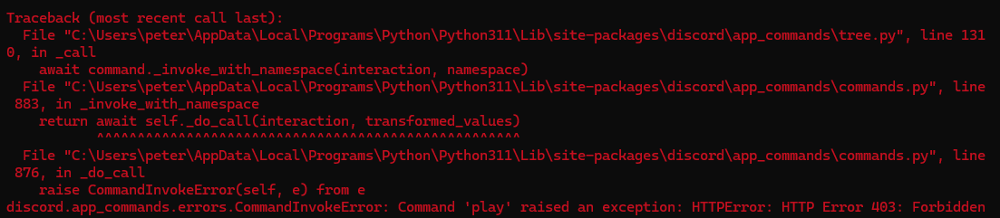

# nikaidoshinku-bot

new discord music bot

## 2024/07/19重大更新:

### 🛠️ refactoring進度:

```
➖/join :(已經可以使用play功能直接呼叫並播歌，此功能已被整合)讓機器人到發話者的語音頻道
✅/leave : 讓機器人退出語音頻道
✅/play YouTube影片網址 : 增加歌曲到播放清單並播放，將playlist(播放清單的功能整合進來)
✅/list : 查詢當前播放清單
❌/look : 查詢指定位置的歌曲
✅/now : 查詢當前播放歌曲
☑️/skip 次數 : 跳過指定次數的歌曲，沒有次數參數會預設為1首(跳過一首)
❌/insert: 插入一首歌到下一首
✅/pause : 暫停音樂
✅/resume : 恢復音樂
```
### ⚠️ Bug修復: pytube無法下載音樂



#### resolved:
[https://github.com/pytube/pytube/issues/1750](https://github.com/pytube/pytube/issues/1750)

change pytube(package) -> cipher.py -> line272, line273:
```python
r'a\.[a-zA-Z]\s*&&\s*\([a-z]\s*=\s*a\.get\("n"\)\)\s*&&\s*'
r'\([a-z]\s*=\s*([a-zA-Z0-9$]+)(\[\d+\])?\([a-z]\)',
```
to

```python
r'a\.[a-zA-Z]\s*&&\s*\([a-z]\s*=\s*a\.get\("n"\)\)\s*&&.*?\|\|\s*([a-z]+)',
r'\([a-z]\s*=\s*([a-zA-Z0-9$]+)(\[\d+\])\([a-z]\)',
```

## command:

```
/join :(已經可以使用play功能直接呼叫並播歌，此功能已被廢止)讓機器人到發話者的語音頻道
/leave : 讓機器人退出語音頻道
/play YouTube影片網址 : 增加歌曲到播放清單並播放，將playlist(播放清單的功能整合進來)
/list : 查詢當前播放清單
/look : 查詢指定位置的歌曲
/now : 查詢當前播放歌曲
/skip 次數 : 跳過指定次數的歌曲，沒有次數參數會預設為1首(跳過一首)
/insert: 插入一首歌到下一首
/pause : 暫停音樂
/resume : 恢復音樂
```
## 03/21:修正部分網址不能撥放歌曲之錯誤